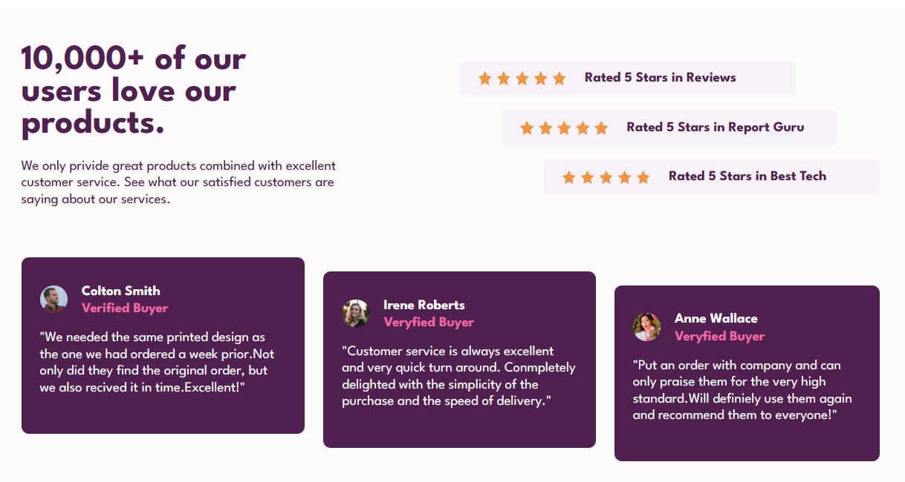
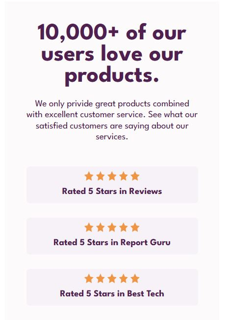
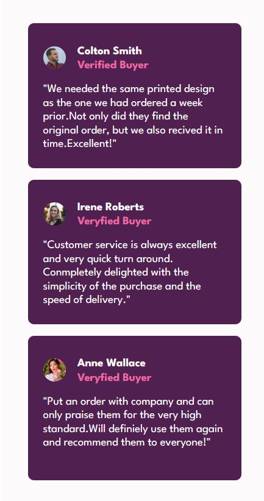

# Frontend Mentor - Social proof section solution

This is a solution to the [Social proof section challenge on Frontend Mentor](https://www.frontendmentor.io/challenges/social-proof-section-6e0qTv_bA).

## Table of contents

- [Screenshot](#screenshot)
- [Links](#links)
- [Built with](#built-with)

### Screenshot

;
;
;

### Links

- Solution URL: [https://github.com/ruwan-chamara/Social-proof-section.git]
- Live Site URL: [https://ruwan-chamara.github.io/Social-proof-section/]

### Built with

- Semantic HTML5 markup
- CSS custom properties
- Flexbox
